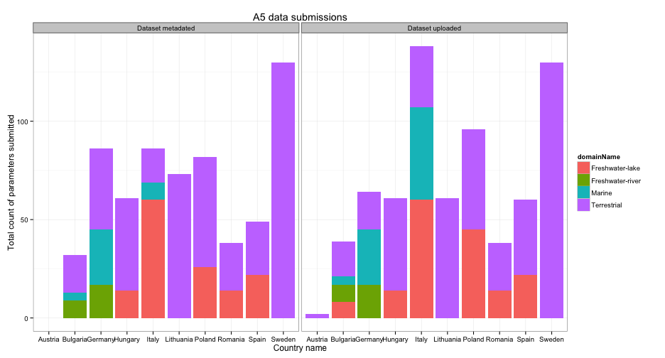

## State of uploading process

* Last updated ``2013-02-13``
* Deadline for data submission: `2013-03-08`
* Days to deadline: ``23``
* Total number of sites sampled in 2012: ``59``; stations: ``61``

<!-- html table generated in R 2.15.2 by xtable 1.7-0 package -->
<!-- Wed Feb 13 07:44:41 2013 -->
<TABLE border=1>
<TR> <TH>  </TH> <TH> No. uploaded </TH> <TH> No. metadated </TH> <TH> Total no. </TH> <TH> Upload ratio </TH> <TH> Metadata ratio </TH>  </TR>
  <TR> <TD align="right"> Year2012 </TD> <TD align="right">  11 </TD> <TD align="right">   0 </TD> <TD align="right"> 1950 </TD> <TD align="right"> 0.01 </TD> <TD align="right"> 0.00 </TD> </TR>
  <TR> <TD align="right"> Year2011 </TD> <TD align="right">   7 </TD> <TD align="right">   0 </TD> <TD align="right"> 218 </TD> <TD align="right"> 0.03 </TD> <TD align="right"> 0.00 </TD> </TR>
  <TR> <TD align="right"> Sum </TD> <TD align="right">  18 </TD> <TD align="right">   0 </TD> <TD align="right"> 2168 </TD> <TD align="right"> 0.01 </TD> <TD align="right"> 0.00 </TD> </TR>
   </TABLE>

---

## Aggregated data

 

## Submissions trend
 

<!-- MotionChart generated in R 2.15.2 by googleVis 0.3.3 package -->
<!-- Wed Feb 13 07:44:41 2013 -->

<!-- jsHeader -->

 
<!-- divChart -->
  

