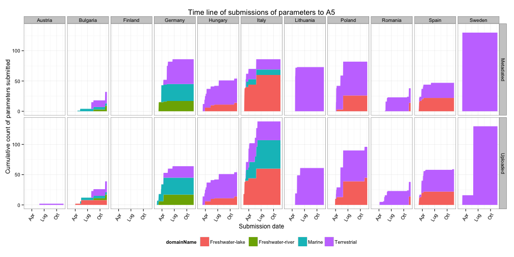

## State of uploading process

* Last updated ``2013-05-02``
* Deadline for data submission: `2013-03-08`
* Days to deadline: ``-55``
* Total number of sites sampled in 2012: ``61``; sub-sites: ``65``

Parameters uploaded and metadated:
<!-- html table generated in R 3.0.0 by xtable 1.7-1 package -->
<!-- Thu May  2 08:37:38 2013 -->
<TABLE border=1>
<TR> <TH>  </TH> <TH> No. uploaded </TH> <TH> No. metadated </TH> <TH> Total no. </TH> <TH> Upload ratio </TH> <TH> Metadata ratio </TH>  </TR>
  <TR> <TD align="right"> Year2012 </TD> <TD align="right"> 253 </TD> <TD align="right"> 355 </TD> <TD align="right"> 2025 </TD> <TD align="right"> 0.12 </TD> <TD align="right"> 0.18 </TD> </TR>
  <TR> <TD align="right"> Year2011 </TD> <TD align="right">  64 </TD> <TD align="right">  90 </TD> <TD align="right"> 270 </TD> <TD align="right"> 0.24 </TD> <TD align="right"> 0.33 </TD> </TR>
  <TR> <TD align="right"> Sum </TD> <TD align="right"> 317 </TD> <TD align="right"> 445 </TD> <TD align="right"> 2295 </TD> <TD align="right"> 0.14 </TD> <TD align="right"> 0.19 </TD> </TR>
   </TABLE>

---

## Aggregated data

 

---

## Submissions time line trend
 

 

